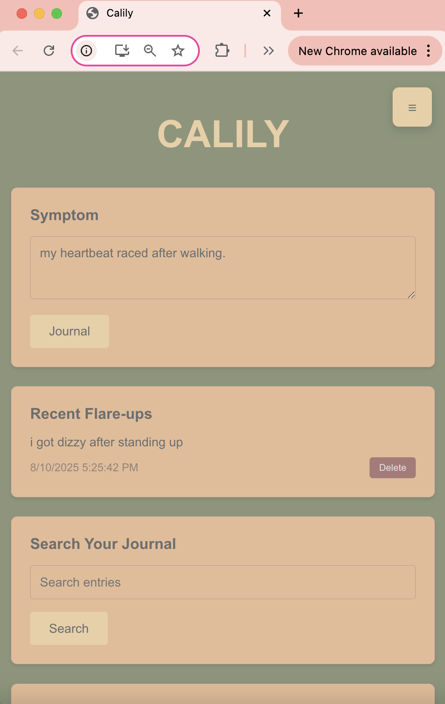
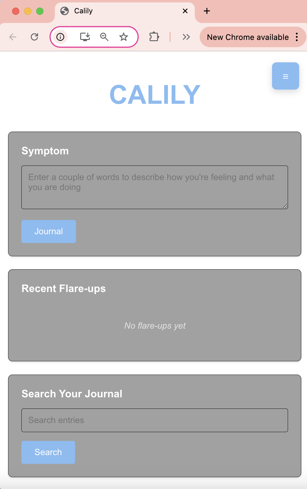
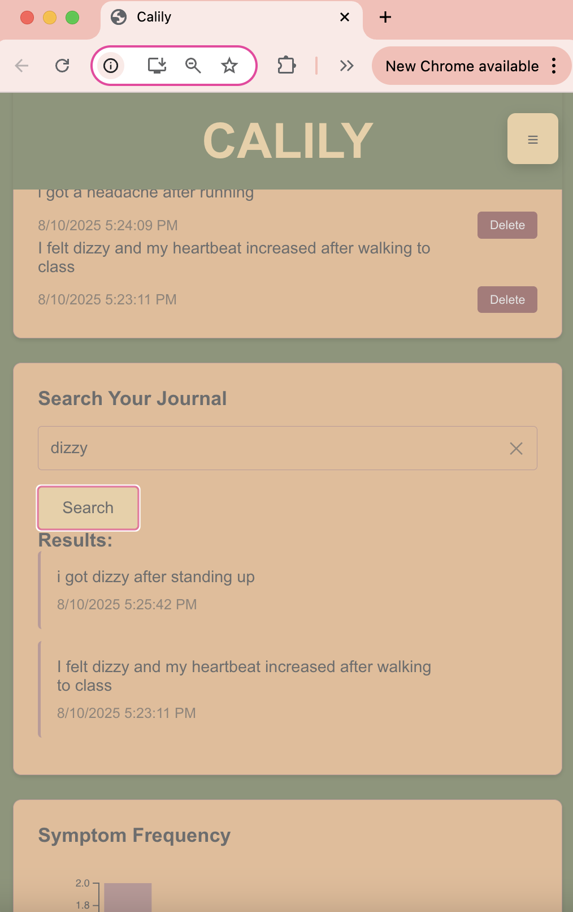
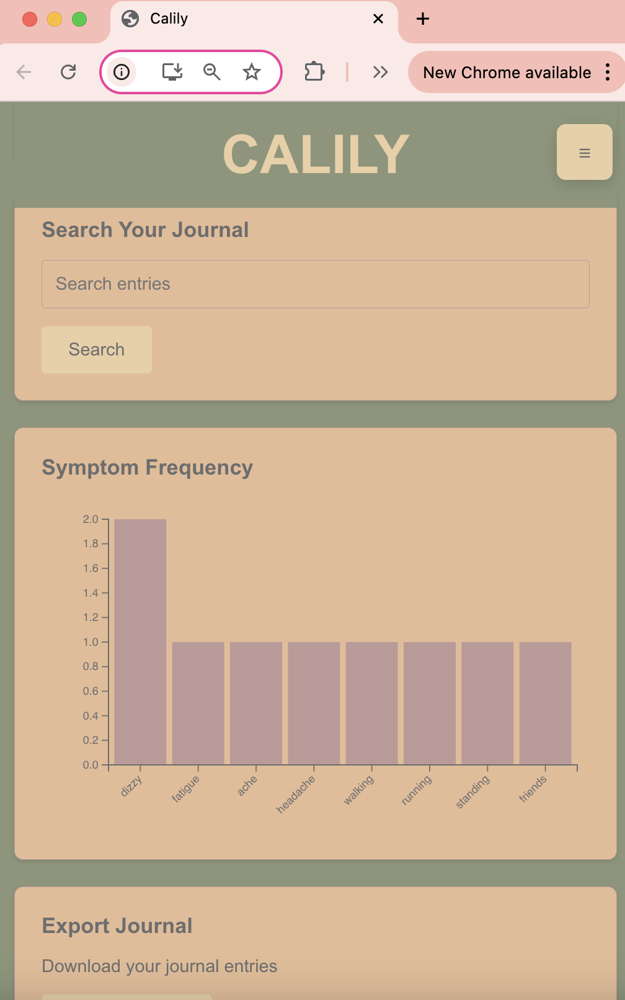
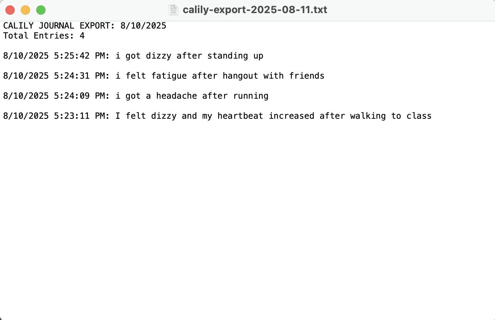
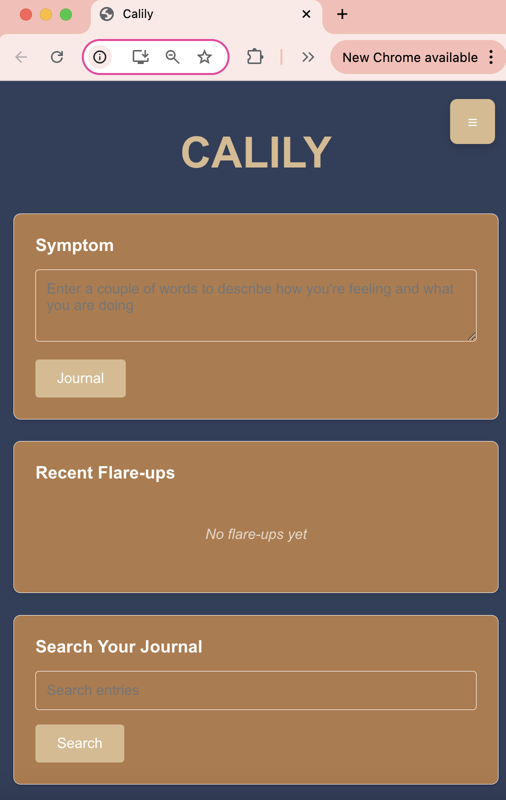

# Calily - Health Journaling App

A full-stack web application designed to help people with autoimmune diseases track and manage their symptoms.

## App Description and Purpose

Calily helps people with autoimmune diseases monitor symptoms, identify patterns, and manage their health data effectively. The app provides a simple platform for daily health journaling.

## Demo Video

📹 **[Watch the Full Demo Video (1:51)](videos/calily-demo.mp4)**

## Installation and Setup Instructions

**Prerequisites:** Node.js and MongoDB must be installed on your system.

### Quick Start

```bash
# Clone the repository
git clone https://github.com/avar777/Calily.git
cd Calily

# Install frontend dependencies
npm install

# Install backend dependencies
cd server
npm install
cd ..

# Start MongoDB service
# Command depends on users OS

# Start the backend server (Terminal 1)
cd server
node server.js

# Start the React development server (Terminal 2)
npm start
```

The app will be available at `http://localhost:3000`

## Technology Stack

### Frontend
- React 18 (with hooks)
- D3.js for the charts
- CSS variables for themes

### Backend
- Node.js and Express
- MongoDB with Mongoose

## Features with Screenshots

### 1. Daily Health Journaling
Create and manage health entries with symptoms, mood, and notes.



### 2. Recent Entries Timeline
View your most recent health entries.



### 3. Search Historical Data
Search through all your health entries by date range or keywords.



### 4. Data Visualization
Interactive D3.js charts showing symptom frequency over time.



### 5. Export Health Data
Export your health data to text files for Doctors.



### 6. Theme Customization
Choose from 5 different themes.



## Feature Documentation

### Currently Working Features
- Creating, editing, and deleting journal entries
- Automatic keyword detection 
- D3.js charts that update when new data comes in
- Search that looks through both text and auto-generated tags
- All 5 themes save your preference
- Responsive design (works on phones)
- Data export feature

### Known Limitations
- Only works for one user (no login system yet)
- Uses local MongoDB (not hosted anywhere)
- Entries are limited to 1000 characters
- Only exports to .txt files
- Search is case-sensitive

### Future Features
- User authentication so multiple people could use it
- Deploy it to the cloud so people could actually use it
- Mobile app version
- More chart types
- Medication tracking
- Better export options (PDF, CSV)

## API Documentation

### Base URL
```
http://localhost:5000/api
```

### Endpoints

#### Entry Management
- **GET** `/entries` - Retrieve all health entries (last 100, sorted by date)
- **POST** `/entries` - Create a new health entry
- **GET** `/entries/:id` - Get a specific entry by ID
- **PUT** `/entries/:id` - Update an existing entry
- **DELETE** `/entries/:id` - Delete an entry

#### Search & Analytics
- **GET** `/search?q={query}` - Search entries by text or tags
- **GET** `/stats` - Get symptom frequency data for charts
- **GET** `/recent` - Get 5 most recent entries
- **GET** `/export` - Export all entries as formatted text

### Data Format
```json
{
  "_id": "ObjectId",
  "text": "Had joint pain and fatigue today. Took medication.",
  "tags": ["joint pain", "fatigue", "medication"],
  "createdAt": "2024-01-15T10:30:00.000Z",
  "updatedAt": "2024-01-15T10:30:00.000Z"
}
```

### Auto-Tagging System
The app automatically tags entries with health-related keywords including:
- Physical symptoms (fatigue, pain, nausea, etc.)
- Emotional states (anxious, sad, stressed, etc.)
- Activities (exercise, work, sleep, etc.)
- Treatments (medication, doctor visits, etc.)

## Contact Information

**Developer:** Ava Raper 
**GitHub:** [@avar777](https://github.com/avar777)  
**Repository:** [Calily](https://github.com/avar777/Calily)  
**Email:** avar@vt.edu