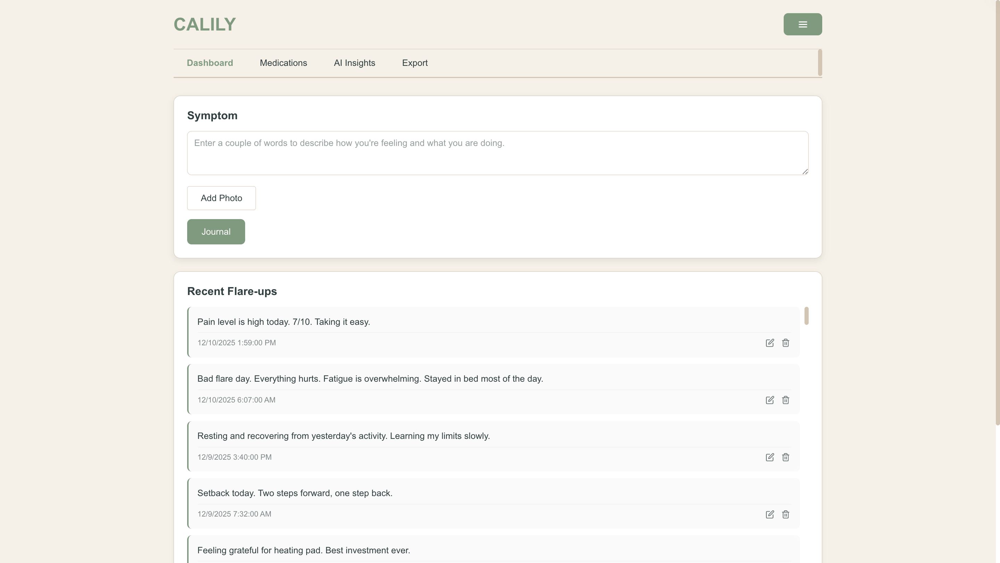

# Calily - AI-Powered Health Journal

A web-based health tracking application designed to help people with chronic illnesses identify patterns, track symptoms, and prepare for doctor visits. Built as a 4-month capstone project with weekly presentations.

[Live Demo](https://calily-api.vercel.app/)



## Background

People with chronic illnesses (autoimmune diseases, chronic pain, mental health conditions) face a common challenge: identifying what triggers their symptoms. Doctors often ask patients to "keep a journal," but paper journals are:

- **Hard to analyze** - Finding patterns across months of entries is nearly impossible
- **Not searchable** - Can't quickly find "all the days I had migraines"
- **Difficult to share** - Bringing stacks of notebooks to appointments isn't practical
- **Time-consuming** - Manually reviewing entries before doctor visits takes hours

Healthcare providers need **condensed, pattern-focused summaries** to make treatment decisions, but patients struggle to synthesize their own data.

Calily solves this by turning daily symptom logs into actionable insights using AI analysis and data visualization.

## Why This Matters

**For Patients:**
- Identify triggers (weather, stress, food, activities) linked to symptom flares
- Arrive at doctor appointments with organized data instead of vague memories
- Track medication effectiveness over time
- Export comprehensive reports showing good days vs. bad days

**For Healthcare Providers:**
- Receive structured symptom summaries instead of verbal recollections
- See medication adherence patterns
- Identify correlations between treatments and outcomes
- Make evidence-based adjustments to care plans

**Healthcare Context:**
According to the CDC, 6 in 10 Americans have a chronic disease. Many conditions (fibromyalgia, POTS, chronic fatigue) require meticulous tracking to manage effectively. Tools like Calily bridge the gap between patient experience and clinical decision-making.

## Key Features

### 1. Symptom Journaling
**Quick daily logging:**
- Text entries describing symptoms, activities, mood, and energy levels
- Photo uploads (rashes, swelling, visible symptoms) stored with entries
- Automatic tagging of 80+ symptom keywords (fatigue, pain, nausea, brain fog, etc.)
- Edit/delete entries with full history tracking

**Technical Implementation:**
- Base64 encoding for image storage (5MB compression limit)
- MongoDB text indexing for fast full-text search
- Client-side image compression before upload
- Auto-tagging via keyword matching on save (Mongoose pre-save hook)

### 2. Medication Tracking
**Daily adherence logging with flexibility:**
- Track multiple medications with dosage, frequency, and notes
- Support for complex schedules (twice daily, three times daily, as-needed)
- Checkbox system for each dose time (Morning, Afternoon, Evening)
- "Track-only" mode for medications without daily reminders
- Historical adherence data for doctor discussions

**Why This Matters:**
Medication non-adherence is a major issue in chronic illness management. This feature helps patients stay on track and provides concrete data for healthcare providers about what's actually being taken vs. what's prescribed.

### 3. AI Health Insights
**Powered by Google Gemini API with four analysis types:**

**Weekly Summary** - Contextual overview of the time period
- Synthesizes entries into 2-3 paragraph summary
- Identifies most common symptoms
- Highlights notable patterns or changes
- Adjusts language based on date range (week/month/custom)

**Pattern Analysis** - Identifies recurring themes
- Correlates symptoms with activities, weather, stress
- Detects timing patterns (worse in mornings, improves with rest)
- Flags potential connections between medication changes and symptoms

**Trigger Identification** - Compares good days vs. bad days
- Analyzes what factors precede symptom flares
- Identifies protective factors present on better days
- Suggests patterns worth monitoring further

**Doctor Visit Preparation** - Generates appointment-ready summary
- Prioritized list of concerns to discuss
- Medication adherence summary
- Specific questions to ask healthcare provider
- Recent symptom timeline

**Technical Implementation:**
- Google Gemini 1.5 Flash API (200 requests/day free tier)
- Request caching (1 hour) to conserve API quota
- Rate limiting to prevent exceeding daily limits
- Structured prompts to ensure consistent, medical-appropriate responses
- Markdown parsing for formatted output

### 4. Data Visualization
**D3.js interactive charts for pattern recognition:**

**Symptom Frequency Chart** - Bar chart showing top 10 most-mentioned symptoms
- Automatically updates as new entries are added
- Helps identify which symptoms dominate over time
- Theme-aware colors that update dynamically

**AI Trend Graph** - Line graph with mood/symptom scoring (1-10 scale)
- AI analyzes entry language to assign severity scores
- Shows improving, declining, or stable trends
- Identifies correlations with medication or activities
- Interactive tooltips on hover

**Why Visualization Matters:**
The human brain processes visual patterns faster than text. Seeing a spike in "headache" mentions or a declining mood trend makes patterns obvious that would be missed in text review.

### 5. Smart Export System
**Multiple export options for different use cases:**

**Entries Only** - Plain text export of journal entries
- Filter by date range (last 7 days, last 30 days, custom range, all time)
- Chronological format with timestamps
- Lightweight file for personal backup

**Entries + Current AI Insights** - Comprehensive report
- Matches export to the date range of generated insights
- Includes all four AI analysis sections
- Formatted for printing/sharing with doctors
- Disclaimer noting insights are observations, not medical advice

**Technical Implementation:**
- Client-side file generation (no server upload needed for privacy)
- Blob API for download triggers
- Maintains formatting for readability
- Smart matching of insight date ranges to entry filters

### 6. Authentication & Security
**Secure user accounts with password recovery:**
- JWT token-based authentication
- Password hashing with bcrypt
- Account lockout after 5 failed login attempts (15 minute cooldown)
- Password reset via 6-digit email code
- Email delivery via Brevo API (300/day free tier)
- User-specific data isolation (can't access other users' entries)

## Technical Architecture

**Frontend:**
- React 18 with functional components and hooks
- Client-side routing (React Router)
- CSS variables for dynamic theming (3 themes: Default, Light, Dark)
- Responsive design for mobile/tablet/desktop
- D3.js for data visualization

**Backend:**
- Node.js + Express REST API
- MongoDB with Mongoose ODM
- JWT authentication middleware
- CORS configuration for Vercel frontend
- Rate limiting on AI endpoints

**Deployment:**
- Frontend: Vercel (auto-deploy from GitHub)
- Backend: Render (free tier with cold starts)
- Database: MongoDB Atlas (512MB free tier)
- Email: Brevo API (300 emails/day free tier)
- AI: Google Gemini API (200 requests/day free tier)

## Data Privacy Considerations

**No Third-Party Analytics:**
Unlike commercial health apps, Calily doesn't sell user data or integrate with advertising networks.

**User-Controlled Data:**
- Export your full journal anytime
- Delete account removes all data
- No data mining or pattern selling

**HIPAA Awareness:**
This is a student project, not a commercial medical device. It's not HIPAA-compliant (would require BAA, encryption at rest, audit logs, etc.). Users should not include highly sensitive medical information they wouldn't want exposed in a data breach.

## Demo Environment Limitations

**This is a capstone/portfolio project running on free-tier services:**

**Cold Starts**: Render free tier spins down after 15 minutes of inactivity. First load may take 30-60 seconds to wake up the backend.

**Password Reset Emails**: Sent via personal email account using Brevo free tier (300/day limit). May appear in spam/junk folders. In production, would use custom domain with SPF/DKIM records.

**AI Rate Limits**: Google Gemini limited to 200 requests/day on free tier. Responses are cached for 1 hour to conserve quota. Heavy usage may hit limits.

**Image Storage**: Photos stored as Base64 in MongoDB. Production would use S3/Cloudflare Images for better performance and cost.

**Database**: MongoDB Atlas free tier with 512MB storage limit. Production would need paid tier for scaling.

These limitations are intentional trade-offs for a student capstone project. Production deployment would use:
- Dedicated backend instances with auto-scaling
- CDN for image hosting
- Enterprise AI API tiers
- Custom email domain with dedicated IP
- Production database with backups
- Redis for caching and session management

## Challenges & Solutions

### 1. AI Cost Management
**Problem**: OpenAI's GPT models would have cost $100+ for this project's usage.

**Solution**: Switched to Google Gemini 1.5 Flash (200 free requests/day). Implemented:
- Response caching (1 hour TTL)
- Rate limiting with user-friendly error messages
- Request counting to prevent hitting quota
- Prompt optimization to reduce token usage

### 2. Image Storage
**Problem**: Need to store photos with entries, but S3/Cloudflare costs money.

**Solution**: Base64 encoding directly in MongoDB with:
- 5MB client-side compression
- Validation before upload
- Lazy loading for timeline view
- Lightbox for full-size viewing

**Trade-offs**: Slower queries and larger database size, but acceptable for MVP.

### 3. Deployment & CORS
**Problem**: Frontend (Vercel) and backend (Render) on different domains caused CORS errors.

**Solution**: 
- Configured Express CORS middleware to whitelist Vercel domains
- Environment variable for frontend URL
- Proper preflight request handling

### 4. Exporting Specific Insights
**Problem**: Users wanted to export the exact insights they just generated, not regenerate them.

**Solution**: 
- Parent component (Dashboard) holds insights state
- Export page receives insights as props
- Matches export date range to generated insight range
- Clear UI showing which date range is being exported

### 5. Medication Dose Tracking
**Problem**: Initial design had one checkbox per day, but users take meds multiple times daily.

**Solution**: 
- Redesigned to support Morning/Afternoon/Evening dose tracking
- Stored as array of "YYYY-MM-DD-DoseTime" strings
- Backward compatible with old single-dose system
- "Track only" option for as-needed medications

## What I Learned

**AI Integration:**
- How to write effective prompts that generate medical-appropriate responses
- Managing API rate limits and caching strategies
- When to use AI vs. when rule-based logic is better

**Healthcare Domain:**
- How chronic illness patients actually use health tracking tools
- The importance of doctor-visit summaries (they don't want raw data dumps)
- Privacy concerns in health tech

**Full-Stack Development:**
- JWT authentication flow
- CORS configuration for cross-origin deployment
- MongoDB schema design for complex relationships
- Base64 encoding trade-offs

**User Experience:**
- Why medication tracking needs to be fast (people won't use it if it's slow)
- The value of date range flexibility (different people want different time windows)
- How to make AI features feel instant even when they take 10+ seconds

## Future Enhancements

**1. PDF Export with Charts**
- Generate visual reports with embedded graphs
- Professional formatting for doctors
- Print-friendly layouts

**2. Medication Reminders**
- Push notifications for dose times
- Integration with calendar apps
- Miss tracking and adherence scores

**3. Weather Correlation**
- Integrate weather API to automatically log conditions
- Identify if barometric pressure affects symptoms
- Humidity/temperature pattern analysis

**4. Multi-User Support (Care Teams)**
- Share read-only access with family members
- Doctor portal for viewing patient data
- Privacy controls for sensitive entries

**5. Mobile App**
- React Native version for iOS/Android
- Push notifications
- Offline mode with sync

**6. Advanced AI Features**
- Predictive flare warnings ("patterns suggest flare in 2-3 days")
- Medication interaction checking
- Symptom severity scoring over time

## Technologies Used

**Frontend:** React, D3.js, CSS Variables  
**Backend:** Node.js, Express, MongoDB, Mongoose  
**Authentication:** JWT, bcrypt  
**AI:** Google Gemini 1.5 Flash API  
**Email:** Brevo API  
**Deployment:** Vercel (frontend), Render (backend), MongoDB Atlas (database)

**Why These Choices:**
- **React**: Component reusability for dashboard cards
- **MongoDB**: Flexible schema for evolving health data model
- **D3.js**: Powerful visualization with full control over styling
- **JWT**: Stateless authentication suitable for REST APIs
- **Google Gemini**: Free tier with good quality/cost ratio for students

## Installation (Local Development)

```bash
# Clone the repository
git clone https://github.com/yourusername/calily.git

# Install backend dependencies
cd calily
npm install

# Install frontend dependencies
cd client
npm install

# Set up environment variables
# Create .env in root with:
# MONGODB_URI=your_mongodb_connection_string
# JWT_SECRET=your_secret_key
# GEMINI_API_KEY=your_google_api_key
# BREVO_API_KEY=your_brevo_key (optional for email)

# Run backend (from root)
npm start

# Run frontend (from /client)
npm start
```

Backend runs on `http://localhost:5001`  
Frontend runs on `http://localhost:3000`

## Sample Data Generation

To test AI features with realistic data:

```bash
node bulk-insert-entries.js
```

This generates 70+ days of sample journal entries spanning October-December 2025.

## Author

Ava Raper - Computer Science Senior Capstone Project

## Acknowledgments

Built over 4 months with weekly presentations to faculty and peers. Thanks to my advisor for guidance on AI integration and the chronic illness community for feature feedback.

## License

MIT